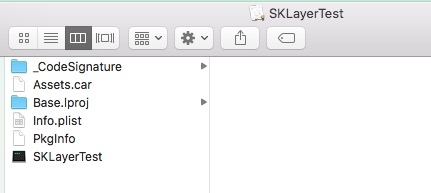
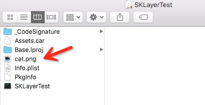
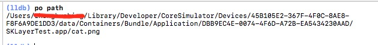

# iOS图片资源问题总结

## 1（组件中）图片资源的读取注意事项

> [NSBundle pathForResource: ofType: ] 方法无法读取xcassets中的图片

- 问题描述和追踪   

组件开发中，使用工具类封装的方法： 

```
+ (UIImage *)imageWithContentsOfFileName:(NSString *)fileName

``` 
却始终无法读取到图片，检查podspec和资源路径，图片的正确性，都无问题。通过追踪，发现在如下代码部分：  

```
filePath = [currentBundle pathForResource:fullName ofType:tempExt];
```
`filePath`始终为`nil`。   
于是通过模拟器，检查`bundle`中实际是否存在图片：   


从上面的目录中无法看到任何的`png`图片，却发现了`Assets.car`，正好图片是存储在`Assets.xcassets`中，有理由怀疑图片是在该文件中。       

查阅苹果文档，对于`NSBundle`的`pathForResource: ofType:`解释[The Bundle Search Pattern](https://developer.apple.com/library/archive/documentation/CoreFoundation/Conceptual/CFBundles/AccessingaBundlesContents/AccessingaBundlesContents.html#//apple_ref/doc/uid/10000123i-CH104-SW7)。其中有一段解释：   

```
It does not recurse through other subfolders at any of these locations
```
该方法不会去检索任何子文件，因为如果图片文件在`Assets.car`文件中，则不会读取。

那如果把图片拿出来，再通过`pathForResource: ofType:`读取呢？   





Got it! 

- 总结

`[NSBundle pathForResource: ofType: ] `方法无法读取`xcassets`中的图片，需要通过其他方式读取，比如系统提供的方法：   

```
UIImage *image = [UIImage imageNamed:imageName inBundle:bundle compatibleWithTraitCollection:nil];
```
