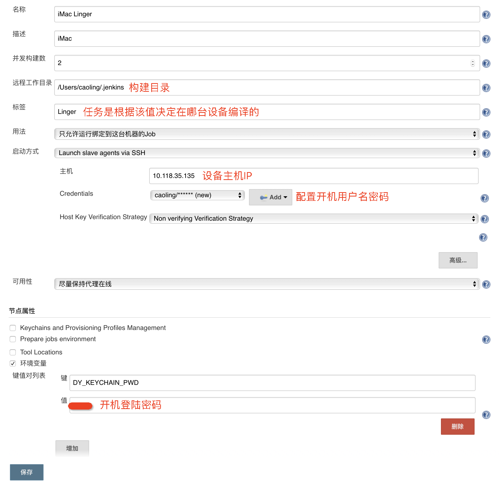
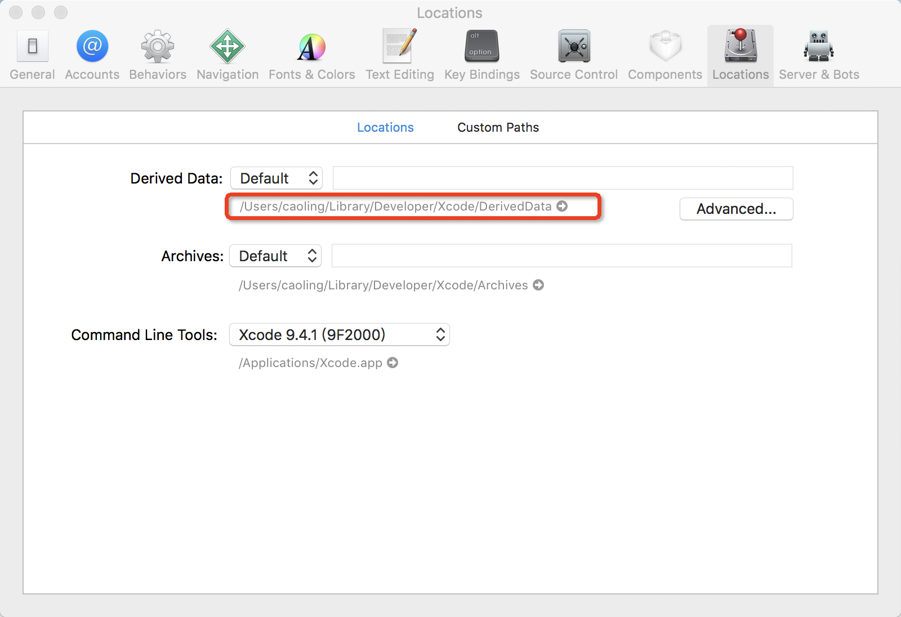
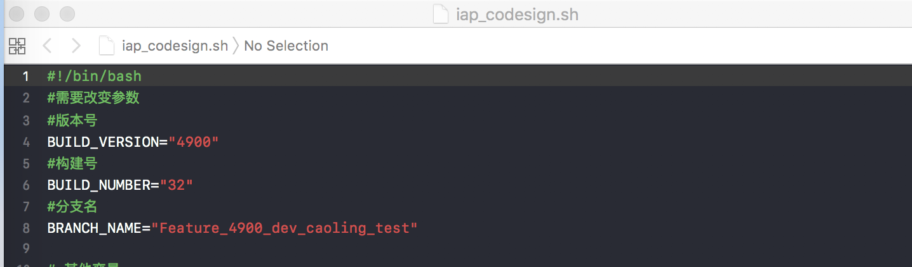

# jenKins 新建节点指南

为解决jenkins编译慢，影响到测试回归问题，现提出两种方案：    
- Jenkins新建节点，多台机器编译；     
- 将本地编译包打包给测试。     
具体操作如下：
## Jenkins新建节点
1. 安装设备环境    
 执行附件中 ready_build.sh，需要clone好多代码，需要等一会。
 
```sh 
#!/bin/bash

# 拉脚本
mkdir -p $HOME/Documents/projects
shell_path=$HOME/Documents/projects/shells
if [ ! -d "$shell_path/" ];then
cd $HOME/Documents/projects
git clone ***.git
# 切分支 ***
# git ***
fi

# 拉主工程
project_path=$HOME/Documents/projects/***
if [ ! -d "$project_path/" ];then
cd $HOME/Documents/projects
git clone ***.git
fi

# sepcs
sepcs_path=$HOME/.cocoapods/***
if [ ! -d "$sepcs_path/" ];then
git clone ***.git sepcs_path
fi

# 打开ssh
sudo launchctl load -w /System/Library/***/ssh.plist

# 配置 key chain 密码，用来给 Jenkins master 访问，需要在从节点配置中的节点属性中的
# Prepare jobs environment 里配置环境变量路径，注意不要勾选 Unset System Environment Variables
# 或直接在环境变量中通过键值对设置 DY_KEYCHAIN_PWD
if [ ! -d "$HOME/.jenkins" ];then
	mkdir $HOME/.jenkins
fi
if [ ! -e "$HOME/.jenkins/env.properties" ];then
	echo "KEYCHAIN_PWD=123" > $HOME/.jenkins/env.properties
fi

#1.启动sshd服务：
#sudo launchctl load -w /System/Library/***/ssh.plist
#2.停止sshd服务：
#sudo launchctl unload -w /System/Library/***/ssh.plist
#查看是否启动：
sudo launchctl list | grep ssh

# 安装jdk
hdiutil attach jdk-8u181-macosx-x64.dmg


# qrcode
# 先装依赖
gem install zlib  -n /usr/local/bin
brew install libpng
#brew install pkg-config cairo pango libpng jpeg giflib
#brew install npm
#npm install --save qrcode
npm install -g qrcode

# 测试 qrcode 安装是否成功
qrcode  "www.baidu.com" -o test.png
``` 

3. 新建jenkins节点

 Jenkins地址：***


配置节点


修改任务的标签为当前节点标签，启动构建，就可以了。

4. 测试下载安装需要下载证书    
***

## 本地编译结果打包给测试
**附件脚本程序**
1. 取本地app包，丢到目录


  
2.切到目录手动改参数iap_codesign.sh

.    
3. 安装qrcode命令

``` 
gem install zlib  -n /usr/local/bin
brew install libpng
#brew install pkg-config cairo pango libpng jpeg giflib
#brew install npm
#npm install --save qrcode
npm install -g qrcode
# 测试 qrcode 安装是否成功
qrcode  "www.baidu.com" -o test.png
``` 
4. 执行iap_codesign.sh

得到QR_Debug.png就可以给测试安装了。


