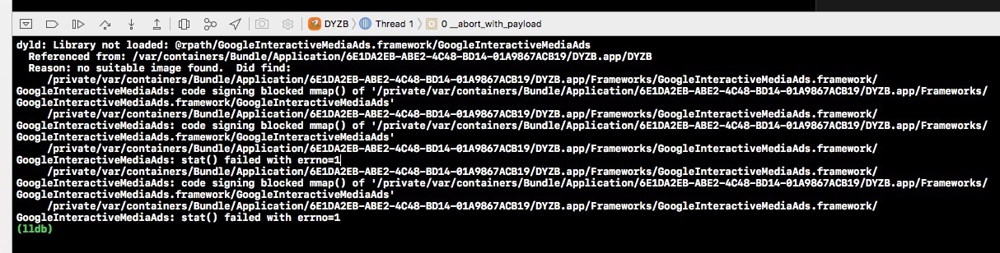

### framework嵌入问题
#### 1 code sign 错误

> 问题原因  

log里面有code signing blocked mmap()这句，动态库的签名需与项目的签名一致才可以真机调试 。具体原因估计是，证书错误导致打包时framework重签名不成功。    

> 解决方案  

* (1) framework在buildSetting里面设为option;   
* (2) 把原来的开发者相关证书删除后，重新安装，得以解决。

#### 2 